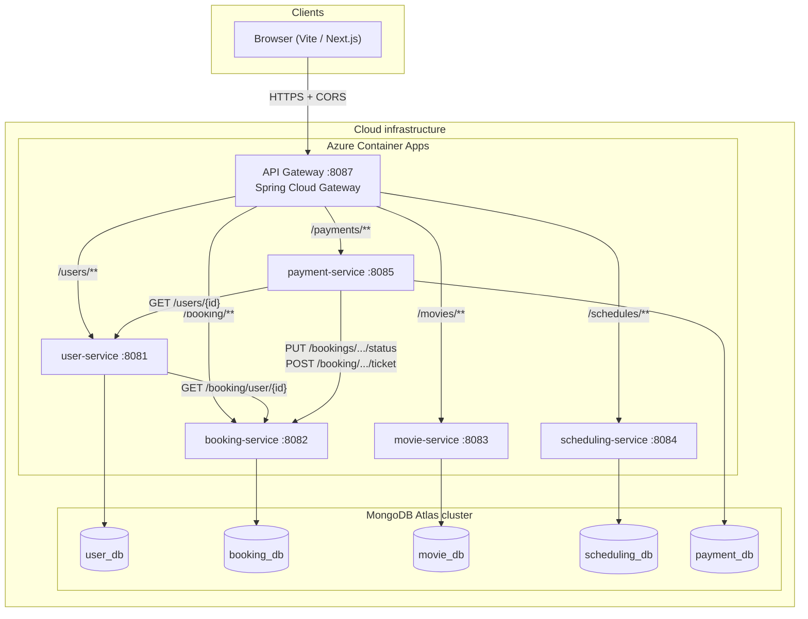

# CTSE Project Report (Code-Based)

This report documents the **movie ticket booking** microservices system as implemented in the project codebase: architecture, component roles, inter-service communication with examples, DevOps and security practices, and observed challenges.

---

## Scope: assignment wording vs repository structure

Some module specifications refer to **four** microservices. The implementation provides **five** domain Spring Boot services—**user**, **booking**, **movie**, **scheduling**, and **payment**—plus a **Spring Cloud API Gateway** as the single HTTP entry for clients. For assessment purposes, the architecture may be classified as **five domain microservices behind one API gateway**, or aligned to a “four microservice” rubric by grouping **movie** and **scheduling** as a catalogue domain, or by other criteria defined in the module. The diagrams include **all** implemented components.

---

## 1. Shared architecture diagram

### 1.1 Logical architecture (Mermaid)

**Database-per-service:** Each microservice owns its own datastore (no shared database schema across services). The diagram shows **five logical databases** inside one Atlas cluster, a common arrangement for operational cost while preserving **bounded contexts**. The local `docker-compose.yml` configuration may reference a single shared database name across several services; production deployments typically assign distinct database names per service.

**Figure:** [`architecture-overview.png`](architecture-overview.png) (raster export of the architecture for documentation).

### 1.2 Source of truth in code

| Concern | Location |
|--------|----------|
| Gateway routes and default Azure URIs | `Gateway/api-gateway/src/main/resources/application.yml` |
| Local ports, env vars, JWT secret, inter-service URLs | `docker-compose.yml` |
| User → booking HTTP call | `User-Backend/user-service/.../UserService.java` |
| Payment → user / booking HTTP calls | `payment-service/.../UserClient.java`, `BookingClient.java` |
| Frontend uses gateway base URL | `Frontend/src/lib/gateway.js` |

**Server-to-server calls (synchronous HTTP):**

- **User service → Booking service:** `RestTemplate` to `{BOOKING_SERVICE_URL}/booking/user/{userId}` to list a user’s bookings.
- **Payment service → User service:** `GET {USER_SERVICE_BASE_URL}/users/{userId}` for optional user validation and profile (when enabled).
- **Payment service → Booking service:** HTTP Basic–authenticated `PUT`/`POST` to update booking status and issue tickets after payment.

**Frontend composition:** The browser loads movies and schedules **only through the gateway** (for example when creating a booking). There is **no** direct movie ↔ scheduling backend call; orchestration is done in the client.

---

## 2. Description and rationale of each component

### API Gateway (`api-gateway`, port 8087)

**Role:** Single entry point for browser and external clients. Routes requests by URL path to the correct downstream service.

**Rationale:** Centralizes **cross-origin (CORS)** configuration so downstream services do not each expose CORS (the user service explicitly disables CORS, expecting the gateway to handle it). Production defaults target **Azure Container Apps** hostnames under `mangohill-a3908265.southeastasia.azurecontainerapps.io`.

### User service (port 8081)

**Role:** User registration and login, JWT issuance, user profile CRUD, and **aggregation** of a user’s bookings by calling the booking service.

**Rationale:** Identity and authorization are centralized; booking data remains owned by the booking service while the user service exposes an aggregated booking list for authenticated users.

### Booking service (`booking-service-late`, port 8082)

**Role:** Manages bookings, show/seat logic, and public endpoints (for example confirmed seats). Exposes **admin** endpoints protected with HTTP Basic authentication used by the payment service to confirm bookings and issue tickets.

**Rationale:** Booking is the transactional core for seats and status; payment automation must update booking state reliably.

### Movie service (port 8083)

**Role:** Movie catalogue (CRUD and queries for the UI).

**Rationale:** Catalogue data is separated from schedules and bookings so that schemas can evolve independently per service.

### Scheduling service (port 8084)

**Role:** Showtimes and schedules linked to movies.

**Rationale:** Scheduling changes (times, screens) do not require redeploying booking or payment logic; the client application combines schedule and movie data during booking flows.

### Payment service (port 8085)

**Role:** Payment orchestration (for example Stripe Checkout), optional user checks, and **callbacks into booking** to set status and issue tickets.

**Rationale:** Payment is a separate bounded context with external provider secrets; isolating it limits PCI-related surface and keeps booking rules in the booking service.

---

## 3. How services communicate (with examples)

### 3.1 Client → gateway → service

All first-hop traffic uses the gateway base URL (for example `http://localhost:8087` in development).

| Example request | Routed to |
|-----------------|-----------|
| `POST /users/login` | User service |
| `GET /movies` | Movie service |
| `GET /schedules/{id}` | Scheduling service |
| `POST /booking` | Booking service |
| `POST /payments` | Payment service |

Paths match `spring.cloud.gateway.routes` in `application.yml` (`/users/**`, `/movies/**`, `/schedules/**`, `/booking/**`, `/payments/**`).

### 3.2 User service → Booking service

- **Call:** `GET {BOOKING_SERVICE_URL}/booking/user/{userId}`
- **Purpose:** Populate `GET /users/{id}/bookings` (or equivalent flows) with booking rows for that user.
- **Resilience:** If the booking service is unreachable, the implementation returns an **empty list** instead of failing the whole user request.

### 3.3 Payment service → User service

- **Calls:** `GET {USER_SERVICE_BASE_URL}/users/{userId}`
- **Purpose:** Verify the user exists (when `USER_SERVICE_ENABLED` is true) and optionally read profile fields for ticketing. The payment service client tolerates **multiple JSON field names** for email and name to accommodate variation in the user API response shape.

### 3.4 Payment service → Booking service

- **Calls:** For example `PUT .../bookings/{bookingId}/status` and `POST .../booking/{bookingId}/ticket` with **HTTP Basic** using `BOOKING_ADMIN_USERNAME` / `BOOKING_ADMIN_PASSWORD`.
- **Purpose:** After successful payment, update booking state and create the ticket record.

### 3.5 Shared JWT

Services that validate user JWTs rely on the **same** `JWT_SECRET` as configured in `docker-compose.yml` and documented in `README.md`, so tokens minted at login are accepted across services.

---

## 4. DevOps and security practices

### DevOps

- **Containers:** Each service has a **Dockerfile**; the root **`docker-compose.yml`** builds and runs the full stack with consistent networking and environment variables.
- **CI (GitHub Actions):** Workflows under `.github/workflows/` run **Maven** `verify`, tests, and **JaCoCo** coverage (for example payment service enforces a high line-coverage threshold). **Checkstyle** runs on payment service builds; **SonarCloud** runs on selected branches for static analysis.
- **CD:** Example **Azure Container Registry** image build/push and **Azure Container Apps** update (see `booking-service-deploy.yml`).
- **Configuration:** Root **`.env`** (from `.env.example`, gitignored) supplies Stripe and payment flags for local and Docker runs.

### Security

- **Authentication:** Stateless **JWT** for user flows; **HTTP Basic** for booking admin endpoints invoked by the payment service.
- **CORS:** Configured **globally on the API gateway** (allowed origins include localhost, Netlify, and Azure Container Apps patterns). Downstream services avoid duplicating CORS headers.
- **Secrets:** Stripe keys and similar values are **environment variables**, not committed. Kubernetes sample manifests show **secrets** for MongoDB URI and service URLs (`payment-service/k8s/`).
- **Authorization:** User service `SecurityConfig` restricts routes by role (for example admin-only user listing).

---

## 5. Challenges (individual and integration)

### Integration challenges

- **API response shape variation:** The payment service’s user client parses several candidate field names for email and name where the user service payload shape may differ from a single fixed schema.
- **Ordering of operations:** Payment calls the booking service **after** a successful charge; failures are logged for manual reconciliation.
- **Optional user validation:** `USER_SERVICE_ENABLED` permits disabling strict user checks during demonstrations or service outages.

### Individual service challenges

- **Centralized CORS:** Client applications are expected to call the **gateway base URL** (`Frontend/src/lib/gateway.js`); direct calls to individual service ports bypass CORS configuration and break deployment assumptions.
- **Shared JWT secret:** Validating services require a **matching** `JWT_SECRET` across environments; mismatches cause authentication failures without clear application-level errors.

### Operational challenges

- **CI/CD credentials:** Azure Container Registry, SonarCloud, and Azure deployment credentials must remain consistent across pipelines; misconfiguration typically surfaces as build or deploy failure rather than as application logic errors.
- **MongoDB Atlas:** The compose configuration uses a shared cluster URI; index and collection changes require coordination to avoid breaking dependent services.

---

## References (file paths)

- Gateway: `Gateway/api-gateway/src/main/resources/application.yml`
- Compose: `docker-compose.yml`
- User → booking: `User-Backend/user-service/src/main/java/com/andrew/user_service/service/UserService.java`
- Payment clients: `payment-service/src/main/java/com/ctse/payment/client/UserClient.java`, `BookingClient.java`
- User security: `User-Backend/user-service/src/main/java/com/andrew/user_service/config/SecurityConfig.java`
- CI: `.github/workflows/payment-service-ci.yml`, `sonarcloud.yml`, `booking-service-deploy.yml`
